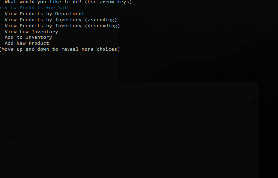
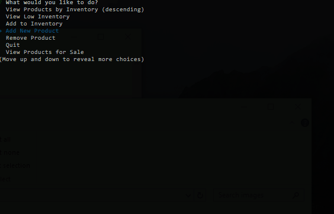

# nodesqlzon
### 'Storefront' using node/sql.

### Technologies
- inquirer to display & select choices in console.
- dotenv to obscure db password
- mysql to connect to SQL database
- easy-table to format columns in console
- es6 await/async with promises
- error handling via try/catch or callback error functions

### Customer View

Customer Completes a Purchase (and DB is updated):

Purchase Rejected - too many requested (no updates to DB):

### Manager View

Manager Views - by id (ascending), by department (alphabetical), by quantity in stock (ascending or descending) and low stock items only:

Manager Adds to Inventory:

Manager Adds New Product:

Manager Removes Product:

The Manager View has a flow that is continuous - you can perform as many actions as you wish and see the results in the product offerings until you choose to quit. This is accomplished via async/await function calls.

### Getting Started

- Clone this repository
- npm install
- Create a database by running "initialize_database.sql" schema
- Create a .env file with DB_PASS=yourpassword
- node customer (to display customer storefront)
- node manager (to display manager functions)
